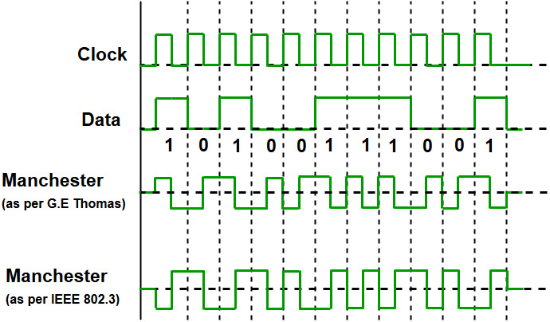
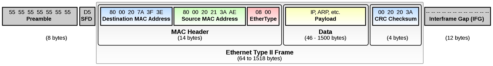
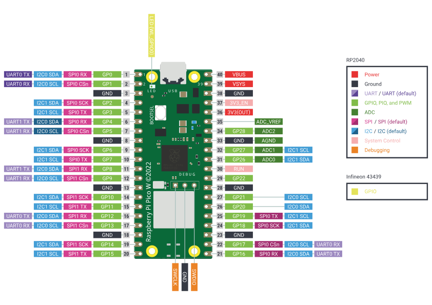

# Physical Layer Encoding (phys-electric)

## Overview

This project explores how data is transmitted at the physical layer using Manchester encoding and error detection techniques. Using two Raspberry Pi Pico boards and GPIO, a simple communication protocol is implemented to demonstrate the concepts.

## Table of Contents
- [Overview](#overview)
- [Software](#software)
  - [Manchester Encoding](#manchester-encoding)
  - [Ethernet](#ethernet)
    - [Ethernet Header](#ethernet-header)
  - [Project Structure](#project-structure)
  - [Software Setup](#software-setup)
    - [Adding Raspberry Pi Pico to VirtualBox USB](#adding-raspberry-pi-pico-to-virtualbox-usb)
    - [Installing SDK](#installing-sdk)
  - [Build, Upload, and Monitor](#build-upload-and-monitor)
  - [How the Code Works](#how-the-code-works)
- [Hardware](#hardware)
  - [Raspberry Pi Pico](#raspberry-pi-pico)
    - [GPIO](#gpio)
  - [Wiring](#wiring)
- [References](#references)

## Software

### Manchester Encoding

Manchester encoding is a synchronized encoding method used to embed the clock signal and data into a single bit stream. This technique is commonly used in computer networks and telecommunications because it combines clock and data signals into one stream, facilitating synchronization. Each data bit is represented by a signal transition, either from high to low or low to high. This characteristic ensures correct data interpretation by the receiving device. Manchester encoding is widely used in Ethernet technology and other digital communication systems due to its reliability and simplicity.



Every bit is represented by a transition:
- A transition from low to high represents a binary '1'.
- A transition from high to low represents a binary '0'.

### Ethernet

Ethernet is the most widely used LAN technology and is defined in the IEEE 802.3 standards. Its widespread adoption is due to Ethernet being easy to understand, implement, and maintain, while enabling network deployment at low cost.

#### Ethernet Header



1. **Preamble (8 bytes)**: A sequence of bytes (`55 55 55 55 55 55 55 D5`) used for synchronizing network devices.
2. **MAC Header (14 bytes)**:
    - **Destination MAC Address (6 bytes)**: The MAC address of the recipient.
    - **Source MAC Address (6 bytes)**: The MAC address of the sender.
    - **EtherType / Length (2 bytes)**: This field can indicate either the length of the payload (in the case of Ethernet 802.3) or the type of higher-level protocol (such as IPv4 or IPv6) used in the transmission.

3. **Data (46-1500 bytes)**: The section that contains the payload, such as IP or ARP packets.
4. **CRC Checksum (4 bytes)**: A code used for error detection in the transmission.
5. **Interframe Gap (IFG) (12 bytes)**: A pause between frames to allow devices to prepare for the next transmission.

### Project Structure

The source code is structured as follows:
```bash
├── build/
├── ethernet/
│   ├── ethernet.cpp
│   └── ethernet.hpp
├── manchester_codec/
│   ├── manchester.cpp
│   └── manchester.hpp
├── pico_prj.cpp
```

- `build/`: folder where compilation files are generated
- `ethernet/`: Ethernet frame encapsulation/decapsulation + CRC/FCS
- `manchester_codec/`: Manchester encoding/decoding + preamble synchronization
- `pico_prj.cpp`: main application (sender/receiver)

### Software Setup

To download the code, you can use the `git clone` command:
```bash
git clone <repository_url>
```

To run the code, you need to install the [Raspberry Pi Pico](https://marketplace.visualstudio.com/items?itemName=raspberry-pi.raspberry-pi-pico) extension in Visual Studio Code.

#### Adding Raspberry Pi Pico to VirtualBox USB

If you are using VirtualBox, you need to pass the Raspberry Pi Pico through to the VM as a USB device. Open VirtualBox, select the virtual machine, and go to **Settings**. In the **USB** tab, enable the **Enable USB 2.0 (EHCI) Controller** option and add a new USB device. Select the Raspberry Pi Pico board from the list of available devices.

After adding the board, open the terminal and run `lsusb` to verify that the board is recognized. You should see a line like:

```text
Bus 002 Device 002: ID 2e8a:000a Raspberry Pi Pico
```

Using the command `sudo dmesg | grep tty`, you should see a message similar to:
```text
[ 619.266764] cdc_acm 2-1:1.0: ttyACM0: USB ACM device
```

If it does not appear, check if the cdc_acm driver is enabled.
```bash
sudo modprobe cdc_acm
```

If you get `FATAL: Module`, you need to install:
```bash
sudo apt update
sudo apt install linux-modules-extra-$(uname -r)
```

Finally, check if the serial port is activated:
```bash
sudo modprobe cdc_acm
sudo dmesg | grep tty
ls /dev/ttyACM*
```

#### Installing SDK

After installing the extension, open it and select the **Import Project** option. From the window that opens, select the `phys-electric` folder that you cloned earlier. Then, select the **Compile Project** option to compile the code.

> If you have problems compiling, download the SDK for Raspberry Pi Pico using the command below:
```bash
git clone -b master https://github.com/raspberrypi/pico-sdk.git /home/student/pico-sdk
cd /home/student/pico-sdk
git submodule update --init
```

After returning to the `phys-electric` folder:
```bash
rm -rf build
mkdir build
cd build
export PICO_SDK_PATH=<path_to_pico_sdk>
vim CMakeLists.txt
cmake -G Ninja ..
```

When modifying CMakeLists.txt, change the SDK version to the one you have installed. For example:
```cmake
set(sdkVersion 2.1.1)
...
set(picotoolVersion 2.1.1)
```

### Build, Upload, and Monitor

After compilation completes, press and hold the *BOOTSEL* button on the Raspberry Pi Pico board and connect it to your computer. This will make the board appear as a USB storage device. From the extension window, select the Upload Project option to load the code onto the board.

> If you have any issues with the upload process, you can manually copy the generated `.uf2` file from the `build` folder to the Raspberry Pi Pico USB storage device.

After the code has been successfully uploaded, you can use the Serial Monitor in Visual Studio Code to verify that the data is being transmitted correctly. Open the Serial Monitor and set the baud rate to **9600 bps** and the line ending to **LF**.

> If the Serial Monitor does not work, you can use `minicom` to view the data. Install `minicom` using your package manager and run it with the appropriate settings to connect to the serial port of the Raspberry Pi Pico.

### How the Code Works

#### Main Components

- `pico_prj.cpp`: Application entrypoint. Configures Pico/Wi-Fi LED, then runs either a sender or receiver loop.
- `manchester_codec/`: Manchester line coding + framing sync (preamble).
- `ethernet/`: A minimal Ethernet frame builder/parser with CRC32-based Frame Check Sequence (FCS).

#### Data Path (Sender)

1. Payload is defined as `sending_data` in `pico_prj.cpp`.
2. `Ethernet::eth_encap(...)` builds a frame:
    - Destination MAC (6 bytes)
    - Source MAC (6 bytes)
    - EtherType (2 bytes)
    - Payload (N bytes)
    - FCS (4 bytes, CRC32 over header + payload)
3. `Manchester::send_manchester(...)` adds a sync preamble (8 bytes: `0xAA...0xAB`) and encodes each transmitted byte on `TX_PIN`.

#### Data Path (Receiver)

1. `Manchester::recv_manchester(...)` first calls `wait_for_preamble()` to synchronize to the byte stream.
2. It decodes a fixed number of bytes into a raw frame buffer.
3. `Ethernet::eth_decap(...)` validates the frame and returns the payload if valid.
4. The payload bytes are printed to the serial console.

#### Error Detection

- **CRC/FCS validation**: `Ethernet::eth_decap(...)` recomputes CRC32 and compares it to the received FCS. If it doesn’t match, the frame is rejected.
- **Basic header checks**: `eth_decap(...)` also verifies EtherType and destination MAC address.
- **Manchester validity checks**: If a sampled Manchester bit doesn’t match a legal transition, decoding returns `-1` and the receive function stops early.

Notes/limitations:
- There is no retransmission, acknowledgement, or sequence numbering; invalid frames are simply dropped.
- The receiver currently assumes a fixed payload size (`sending_data_len`) to know how many bytes to read.

#### Sender vs Receiver Mode

In `pico_prj.cpp`, the role is selected via the `type` string (currently set to `"sender"`). To test the communication, set one board to `"sender"` and the other to `"receiver"`, then upload the code to both boards. The sender will transmit the defined payload, and the receiver will print the received data to the serial console if the frame is valid.

## Hardware

### Raspberry Pi Pico

The Raspberry Pi Pico is a microcontroller based on the RP2040, offering a versatile platform for hardware project development. It features 26 GPIO pins that can be used to connect various sensors, modules, and external devices.



#### GPIO

General-Purpose Input/Output (GPIO) refers to the programmable control capability of integrated circuit pins, allowing their behavior to be configured through software. These pins can be dynamically set to function as either inputs or outputs. When configured as an output, a GPIO pin can be programmed to source either a logic '0' (low voltage) or a logic '1' (high voltage). When configured as an input, the GPIO pin can sense external voltage levels, allowing the system to determine whether it is being driven to a logic '0' or logic '1' state by an external circuit.

### Wiring

To run this project, you will need the following resources:
- 2 Raspberry Pi Pico boards
- 2 micro USB cables
- 3 Dupont jumper wires

The two Raspberry Pi Pico boards will be connected as follows:
- Pin 16 (GPIO 12) of the first board will connect to pin 17 (GPIO 13) of the second board
- Pin 17 (GPIO 13) of the first board will connect to pin 16 (GPIO 12) of the second board
- Pin 18 (GND) of the first board will connect to pin 18 (GND) of the second board

## References
- [Raspberry Pi Pico Datasheet](https://datasheets.raspberrypi.com/pico/pico-datasheet.pdf)
- [Ethernet Frame Format](https://www.geeksforgeeks.org/ethernet-frame-format/)
- [Manchester Encoding](https://en.wikipedia.org/wiki/Manchester_encoding)
- [Computer Networking Laboratories](https://pcom.pages.upb.ro/labs/)